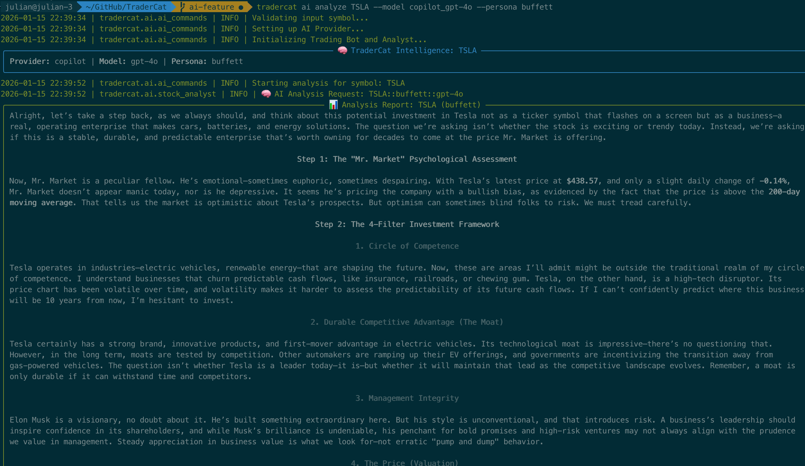
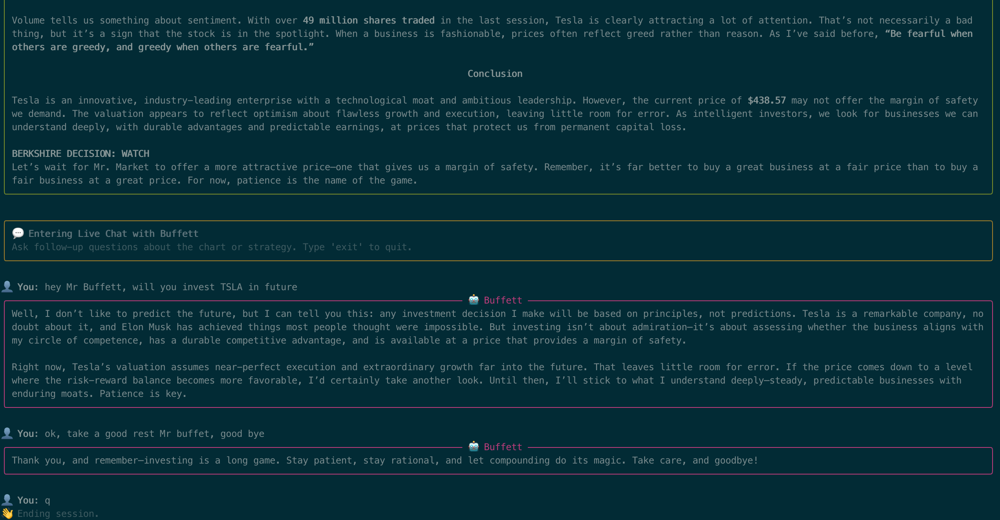

# TraderCat 🐱📈

[](https://opensource.org/licenses/MIT)

[](https://github.com/psf/black)
[](https://github.com/AimeSoleil/TraderCat/graphs/commit-activity)

**TraderCat** is a next-generation hybrid trading terminal. It merges high-performance **Quantitative Algorithmic Trading** with contextual **Generative AI** analysis.

Unlike traditional bots that rely solely on hard-coded indicators, TraderCat can "see" the market through the lens of legendary investors (via AI Personas) and allows you to chat interactively with the data, all while running a highly concurrent algorithmic execution engine in the background.

## 🚀 Key Features

### 🧠 AI Market Intelligence
*   **Persona-Driven Analysis**: Ask "Wyckoff" about distribution phases or "Buffett" about value zones.
*   **Interactive Chat**: Don't just read a static report—enter a live chat session to ask follow-up questions about the specific symbol context.
*   **Multi-Model Core**: Seamlessly switch between **GitHub Models** (GPT-4o, o1, Phi-3) or mock providers for testing.
*   **Stateless Architecture**: Hot-swap models and personas on the fly.

### ⚡ Quantitative Engine
*   **AsyncIO Performance**: Process hundreds of symbols concurrently with efficient staggering.
*   **Multi-Strategy Support**: Technical (Bollinger, RSI), Pattern Recognition (Candlesticks), and Portfolio (Sector Rotation) strategies.
*   **OpenBB Integration**: Uses institutional-grade data sources.
*   **Robust Reporting**: Automated CSV logging and Discord notifications.

---

## 📂 Architecture

The system has been refactored into a clean, modular `src` layout:

```text
TraderCat/
├── src/
│   └── tradercat/
│       ├── main.py          # Unified CLI Entry Point (Router)
│       ├── ai/              # AI Subsystem
│       │   ├── ai_commands.py  # AI CLI Controller (View Logic)
│       │   ├── llm_providers.py # LLM Backends (GitHub/Azure, Mock)
│       │   └── prompts/    # Prompt Templates (Wyckoff, etc.)
│       ├── session_runner.py    # Core Session Engine (SessionRunner)
│       ├── bot.py           # Trading Bot Logic
│       ├── strategy/        # Algorithmic Strategies
│       └── utils/           # SymbolLoader, Logger
├── tests/                   # Unit Tests
└── public/                  # Assets and images
```

## 🛠️ Installation

### Prerequisites
*   Python 3.10+
*   [Optional] Virtual Environment (recommended)

### Setup

1.  **Clone the repository:**
    ```bash
    git clone https://github.com/AimeSoleil/TraderCat.git
    cd TraderCat
    ```

2.  **Install in Editable Mode:**
    This installs the project and its dependencies while allowing you to edit the code without reinstalling.
    ```bash
    pip install -e .
    ```

3.  **Install Development Dependencies (Optional):**
    For running tests or contributing.
    ```bash
    pip install -e ".[dev]"
    ```

## ⚙️ Configuration

Create a `.env` file in the root directory.

### 1. AI Authentication (Required for AI Features)
TraderCat uses **GitHub Models** (via Azure AI Inference). You need a GitHub Personal Access Token.
*   `TRADERCAT_AI_TOKEN`: Your GitHub PAT (or Azure Key).

### 2. General Settings
*   `DISCORD_WEBHOOK_URL`: (Optional) For trade alerts.
*   `ENV_SYMBOLS`: (Optional) Default fallback symbols (e.g., "AAPL,TSLA").

## 🖥️ Usage

TraderCat operates with two main modes: `ai` (Intelligence) and `run` (Automation).

### Mode 1: 🧠 AI Intelligence (`ai`)

Use this mode for deep-dive analysis and interactive research.

<p align="center">
  
  
  <br>
  <i>Interactive chat session with the "Warren Buffett" persona for clear chart data analysis.</i>
</p>

**Analyze a Symbol (Deep Dive):**
Generates a report and starts a chat session.
```bash
tradercat ai analyze TSLA
```

**Advanced Usage:**
Switch analysts and models.
```bash
# Ask "Warren Buffett" about Apple
tradercat ai analyze AAPL --persona buffett

# Use a specific reasoning model
tradercat ai analyze NVDA --model copilot_o1 --no-chat
```

**Discovery Commands:**
```bash
# See all supported personas (e.g., wyckoff, livermore)
tradercat ai list-personas

# See all supported models from your provider
tradercat ai list-models
```

### Mode 2: 🚀 Automated Trading (`run`)

Use this mode for batch processing, scanning, and signal generation.

**Execute a Trading Session:**
```bash
# Scan specific symbols
tradercat run -s "AAPL,MSFT,GOOG"

# Scan from a file (YAML or TXT)
tradercat run -f symbols.yml

# Run only Sector Rotation strategies (Portfolio Scope)
tradercat run --scope portfolio
```

**CLI Options Table:**
| Flag | Description | Default |
| :--- | :--- | :--- |
| `-s`, `--symbols` | Comma-separated tickers. | `None` |
| `-f`, `--symbols-file` | Path to symbols file. | `None` |
| `-c`, `--concurrency` | Max concurrent bots. | `5` |
| `--scope` | `single` (stocks), `portfolio` (sectors), or `all`. | `single` |

---

## 🤖 AI Providers & Personas

### Supported Providers
The system uses a factory pattern to load LLMs.
1.  **Copilot (GitHub Models)**: Access to GPT-4o, Phi-3, Llama-3, etc. free with a GitHub account.
2.  **Mock**: A dummy provider for testing flow without API calls (`--model mock`).

### Analyst Personas
*   **Standard**: Balanced technical/fundamental mix.
*   **Wyckoff**: Focus on accumulation/distribution and market cycles.
*   **Buffett**: Focus on value, moats, and long-term hold.
*   **Livermore**: Focus on price action, pivot points, and trend following.

---

## ⏰ Automation (Cron)

Since the internal scheduler is decoupled, use **Cron** (Linux/Mac) for daily automation.

**Example Crontab:**

```cron
# Set Timezone to ensure 5:00 PM is always New York time
CRON_TZ=America/New_York

# 1. Daily Swing Trading Signals (Mon-Fri at 5:00 PM)
# Logs are saved with date suffix (NOTE: % must be escaped with \ in crontab)
0 17 * * 1-5 cd /path/to/TraderCat && /path/to/python -m tradercat run -f symbols.yml --scope single >> logs/daily_swing_$(date +\%Y-\%m-\%d).log 2>&1

# 2. Weekly Portfolio Rebalancing (Fridays at 5:00 PM)
# Runs sector rotation strategies (No symbols file needed)
0 17 * * 5 cd /path/to/TraderCat && /path/to/python -m tradercat run --scope portfolio >> logs/weekly_portfolio_$(date +\%Y-\%m-\%d).log 2>&1
```

### CLI Options (for `run` command)

| Option | Long Option | Description | Default |
| :--- | :--- | :--- | :--- |
| `-s` | `--symbols` | Comma-separated list of symbols (e.g., `AAPL,TSLA`). | `None` |
| `-f` | `--symbols-file` | Path to a `.txt` or `.yaml` file containing symbols. | `None` |
| `-c` | `--concurrency` | Max number of bots running at the same time. | `5` |
| `-S` | `--stagger` | Seconds to wait between starting bots (prevents API rate limits). | `2` |
|| `--scope` | Execution scope: `all` (default), `single`, or `portfolio`. | `all` |

## 🧠 Strategies

TraderCat comes with several built-in strategies located in `src/tradercat/strategy/`:

*   **Candlestick Patterns**: Detects patterns like Hammer, Engulfing, Morning Star, etc.
*   **Bollinger Bands**: Breakout and Reversal strategies.
*   **Momentum**: RSI and other momentum-based indicators.
*   **Sector Rotation**: Analyzes sector performance to find rotation opportunities.
*   **Fibonacci Retracement**: Identifies potential support/resistance levels.
*   **Divergence**: Detects divergence between price and indicators.

## 📈 Backtesting

TraderCat includes a built-in backtesting engine to evaluate your strategies against historical data.

### Running a Backtest

1.  **Configure**: Open `src/tradercat/backtest/main.py` and modify the `BacktestConfig` class to set your desired parameters:
    *   `start_date` / `end_date`
    *   `initial_cash`
    *   `target_symbols` (e.g., `["AAPL", "TSLA"]`)
    *   `active_strategies` (Select which strategies and presets to test)

2.  **Run**: Execute the backtest module:
    ```bash
    python -m tradercat.backtest.main
    ```

3.  **Analyze**: The engine will simulate trading and output a performance report, including:
    *   Final Portfolio Value
    *   Net Profit
    *   Win Rate
    *   Max Drawdown
    *   Trade Logs

## 🧪 Testing

Run the unit test suite to ensure everything is working correctly.

```bash
# Run all tests
pytest

# Run specific tests (e.g., candle patterns)
pytest tests/strategy/candle_pattern/detectors
```

## 🤝 Contributing

Contributions are welcome! Please feel free to submit a Pull Request.

1.  Fork the project.
2.  Create your feature branch (`git checkout -b feature/AmazingFeature`).
3.  Commit your changes (`git commit -m 'Add some AmazingFeature'`).
4.  Push to the branch (`git push origin feature/AmazingFeature`).
5.  Open a Pull Request.

## 📄 License

Distributed under the MIT License. See `LICENSE` for more information.